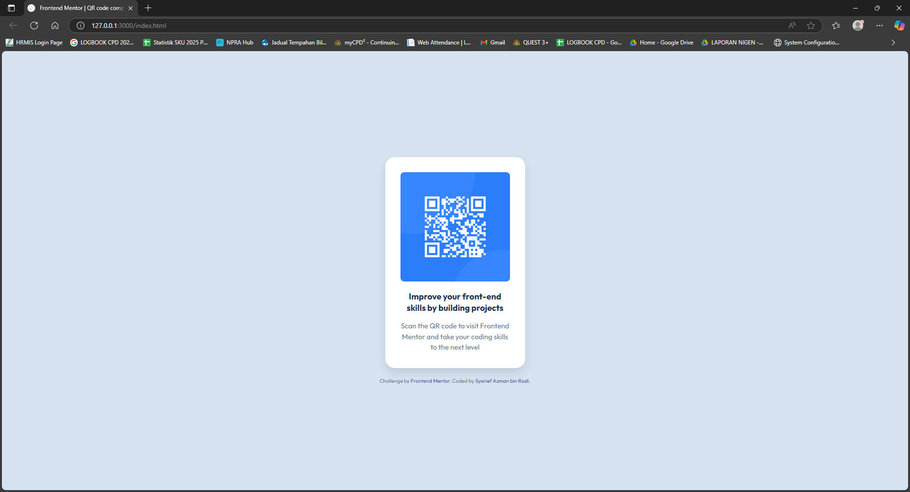

# Frontend Mentor – QR Code Component Solution

This repository contains my solution to the [QR Code Component challenge on Frontend Mentor](https://www.frontendmentor.io/challenges/qr-code-component-iux_sIO_H). The goal was to build a pixel-perfect, responsive component that displays a styled QR code card—matching the exact colors, typography, and spacing from the official design.

---

## Table of Contents

- [Overview](#overview)
  - [Screenshot](#screenshot)
  - [Links](#links)
- [My Process](#my-process)
  - [Built With](#built-with)
  - [What I Learned](#what-i-learned)
  - [Continued Development](#continued-development)
  - [Useful Resources](#useful-resources)
- [Author](#author)
- [Acknowledgments](#acknowledgments)

---

## Overview

### Screenshot



> The screenshot above shows the final QR code card centered on a light‐blue background, with the correct HSL color values, “Outfit” typography, and responsive sizing.

### Links

- **Solution URL:** [https://github.com/syarief02/qr-code-component.git](https://github.com/syarief02/qr-code-component.git)
- **Live Site URL:** [https://syarief02.github.io/qr-code-component/](https://syarief02.github.io/qr-code-component/)

---

## My Process

### Built With

- **Semantic HTML5** markup (proper use of `<header>`, `<main>`, `<footer>` semantics).
- **CSS3**
  - CSS custom properties for color variables (`--color-slate-300`, `--color-slate-500`, `--color-slate-900`, etc.).
  - Flexbox for vertical and horizontal centering.
  - Mobile‐first responsive layout (fluid width + `max-width` cap).
- **Google Fonts – [Outfit](https://fonts.google.com/specimen/Outfit)** (weights 400 & 700).
- **No JavaScript**—the component is purely HTML & CSS.

### What I Learned

- **Pixel‐Perfect Replication:** I practiced translating a Figma/PNG design layout into exact HSL-based CSS variables and correct `border-radius`, `box-shadow`, and `line-height` values.
- **Responsive, Mobile-First Workflow:** By using `width: 90%; max-width: 320px;` on the card container, I ensured that on very narrow viewports the card still shrinks gracefully (down to ~320px or below), and on larger screens it remains centered and visually balanced.
- **CSS Custom Properties:** Defining color variables at the top of `:root` made it trivial to reference and maintain the exact “Slate 300” (hsl(212, 45%, 89%)), “Slate 500” (hsl(216, 15%, 48%)), and “Slate 900” (hsl(218, 44%, 22%)) values throughout the stylesheet.
- **Flexbox Centering:** Using `display: flex; flex-direction: column; align-items: center; justify-content: center;` on `<body>` guaranteed that the card and its attribution stack vertically and stay perfectly centered both horizontally and vertically.

```css
:root {
  --color-white: hsl(0, 0%, 100%);
  --color-slate-300: hsl(212, 45%, 89%);
  --color-slate-500: hsl(216, 15%, 48%);
  --color-slate-900: hsl(218, 44%, 22%);
}

body {
  display: flex;
  flex-direction: column;
  align-items: center;
  justify-content: center;
  background-color: var(--color-slate-300);
  font-family: 'Outfit', sans-serif;
  min-height: 100vh;
  margin: 0;
}
```
### Continued Development

* **Accessibility Improvements:** Although the design is purely visual, I’d like to add more semantic ARIA roles or test keyboard‐only navigation to ensure someone scanning the page with a screen reader can easily understand that this is a QR code leading to an external site.
* **Dark‐Mode Variant:** Implement a toggle that switches between the existing light mode (slate‐300 background with white card) and a “dark mode” (e.g., a very dark background with a darker card tone). This exercise will reinforce theming using CSS custom properties.
* **Animation / Hover Effects:** Explore subtle hover states—perhaps a gentle scale or drop‐shadow intensification on the card when the user hovers over it, while keeping with WCAG contrast guidelines.

### Useful Resources

* [Frontend Mentor QR Code Component Challenge](https://www.frontendmentor.io/challenges/qr-code-component-iux_sIO_H) – Official challenge description and design assets.
* [Google Fonts – Outfit](https://fonts.google.com/specimen/Outfit) – Used for all typography (weights 400 & 700).
* [MDN – CSS Variables](https://developer.mozilla.org/en-US/docs/Web/CSS/Using_CSS_custom_properties) – Reference for defining and using CSS custom properties.
* [FreeCodeCamp – A Complete Guide to Flexbox](https://www.freecodecamp.org/news/complete-guide-to-flexbox/) – Helpful when centering content both vertically and horizontally.

---

## Author

**Syarief Azman bin Rosli**

* GitHub: [@syarief02](https://github.com/syarief02)
* Frontend Mentor: [@syarief02](https://www.frontendmentor.io/profile/syarief02)
* Email: [syarief.azman@example.com](mailto:syarief.azman@example.com)

Feel free to contact me if you have any questions about this solution or would like feedback!

---

## Acknowledgments

* Thanks to **Frontend Mentor** for providing the design assets and challenge prompt, which helped me practice pixel‐perfect styling and responsive layout.
* Inspiration from **MDN Web Docs** and **CSS Tricks** for learning best practices around custom properties and Flexbox centering.
* Hat tip to my peers who gave feedback on responsive testing and color‐contrast checks.


